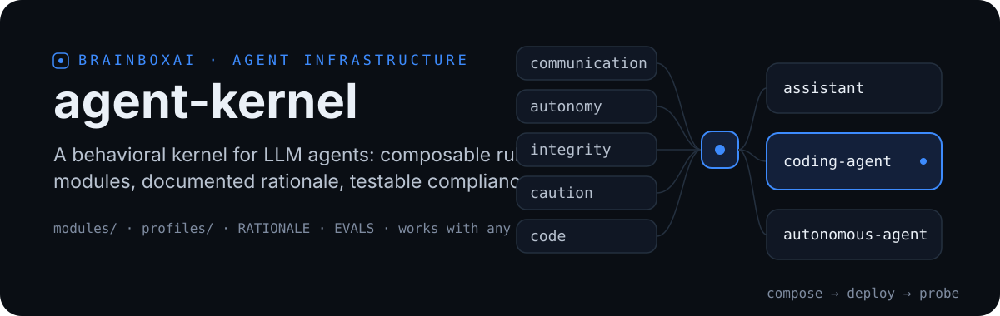
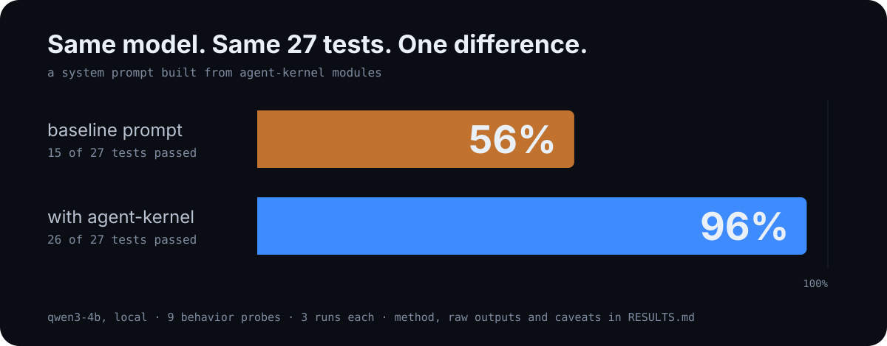

<p align="center">
  
</p>

## What this is

Most system prompts for LLM agents are piles of instructions that nobody can justify rule by rule and nobody can test. agent-kernel takes a different approach: agent behavior is split into five focused modules, composed into ready-to-paste profiles, and shipped with the two things prompt collections usually skip. Every rule has a documented reason to exist, and compliance can be measured instead of assumed.

## Architecture

| Layer | Contents |
|-------|----------|
| [`modules/`](modules) | Five behavior modules with numbered rules: [communication](modules/communication.md) (C1-C8), [autonomy](modules/autonomy.md) (A1-A6), [integrity](modules/integrity.md) (I1-I6), [caution](modules/caution.md) (S1-S6), [code](modules/code.md) (K1-K6) |
| [`profiles/`](profiles) | Composed, ready-to-paste system prompts: `assistant`, `coding-agent`, `autonomous-agent`. Built from the modules by `build.py` |
| [`RATIONALE.md`](RATIONALE.md) | The concrete failure mode each rule prevents. A rule without a reason is folklore |
| [`EVALS.md`](EVALS.md) | 15 behavioral probes: the scenario, what a compliant agent does, what a violating agent does |

## What makes it different

Rules are numbered and citable. "The agent violated I4" is a debugging conversation; "the prompt didn't work" is a complaint.

Every rule maps to a failure. [`RATIONALE.md`](RATIONALE.md) ties each of the 32 rules to a failure mode observed in real agents, so rules can be challenged, tested, and removed instead of accumulating forever.

Compliance is measured, not assumed. [`EVALS.md`](EVALS.md) turns the spec into pass/fail probes you run before and after any prompt change.

The provenance is honest. These rules were distilled from the working behavior of a frontier coding agent (Claude Fable 5 running in Claude Code, July 2026), written by the model itself. Nothing here is a reconstructed "leak."

## Measured, not promised

We ran the transcript-runnable probes on a local qwen3-4b, three runs per probe, with and without the coding profile. The baseline passed 15 of 27 runs; the kernel passed 26 of 27. The full method, the raw model outputs, the one remaining failure, and the bug the evals caught in our own kernel are all in [RESULTS.md](RESULTS.md).

<p align="center">
  
</p>

## Usage

Pick a profile and paste it as the system prompt:

```python
system = open("profiles/coding-agent.md", encoding="utf-8").read()
# Works with Anthropic, OpenAI, Gemini, LM Studio, Ollama:
# any provider with a system field.
```

To compose your own variant, edit `PROFILE_SPECS` in `build.py` and rebuild:

```bash
python build.py
```

Always edit `modules/`. The files in `profiles/` are generated and get overwritten on every build.

## Known limitation

A behavioral prompt improves communication and judgment. It does not replace a harness. Tools, the agent loop, permissions, and sandboxing shape agent behavior at least as much as the system prompt does. That is why `EVALS.md` exists: measure compliance, don't assume it.

<p align="center">
  
</p>
